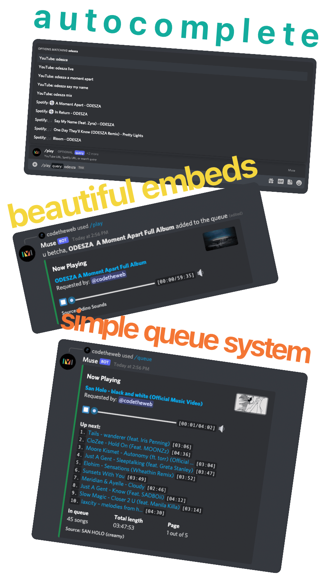

<p align="center">
  
</p>

> [!NOTE]
> This is a fork of [museofficial/muse](https://github.com/museofficial/muse). This fork is very WIP and unstable. Slowly working my way up to be a swiss army knife of self hosted discord music bots.
>
> For the official Muse, see the [upstream repository](https://github.com/museofficial/muse).

------

Muse is a **highly-opinionated midwestern self-hosted** Discord music bot **that doesn't suck**. It's made for small to medium-sized Discord servers/guilds (think about a group the size of you, your friends, and your friend's friends).



## Features

- 🎥 Livestreams
- ⏩ Seeking within a song/video
- 💾 Local caching for better performance
- 📋 No vote-to-skip - this is anarchy, not a democracy
- ↔️ Autoconverts playlists / artists / albums / songs from Spotify
- ↗️ Users can add custom shortcuts (aliases)
- 1️⃣ Muse instance supports multiple guilds
- 🔊 Normalizes volume across tracks
- ✍️ Written in TypeScript, easily extendable
- ❤️ Loyal Packers fan

## Running

Muse is written in TypeScript. You can either run Muse with Docker (recommended) or directly with Node.js. Both methods require API keys.

A 64-bit OS is required to run Muse.

### Getting API Keys

Before starting, you'll need to obtain the following API keys:

#### 1. Discord Bot Token (Required)

1. Go to the [Discord Developer Portal](https://discordapp.com/developers/applications)
2. Click "New Application" and give it a name
3. Go to the "Bot" section in the left sidebar
4. Click "Add Bot" and confirm
5. Under "Token", click "Reset Token" or "Copy" to get your bot token
6. **Important**: Enable these Privileged Gateway Intents:
   - ✅ PRESENCE INTENT
   - ✅ SERVER MEMBERS INTENT
   - ✅ MESSAGE CONTENT INTENT (if you want prefix commands)
7. Save your token - you'll need it for `DISCORD_TOKEN`

#### 2. YouTube API Key (Required)

1. Go to [Google Cloud Console](https://console.developers.google.com)
2. Create a new project (or select an existing one)
3. Enable the "YouTube Data API v3":
   - Go to "APIs & Services" > "Library"
   - Search for "YouTube Data API v3"
   - Click "Enable"
4. Create credentials:
   - Go to "APIs & Services" > "Credentials"
   - Click "Create Credentials" > "API Key"
   - Copy your API key
   - (Optional) Restrict the API key to YouTube Data API v3 for security
5. Save your API key - you'll need it for `YOUTUBE_API_KEY`

#### 3. Spotify API Credentials (Optional but Recommended)

1. Go to [Spotify Developer Dashboard](https://developer.spotify.com/dashboard/applications)
2. Click "Create an App"
3. Fill in the app name and description, accept the terms
4. Copy your "Client ID" and "Client Secret"
5. Save these - you'll need them for `SPOTIFY_CLIENT_ID` and `SPOTIFY_CLIENT_SECRET`

**Note**: Spotify credentials are optional but highly recommended. Without them, you won't be able to play Spotify playlists, albums, or artists directly.

### Versioning

The `master` branch contains the latest changes from this fork. This fork is experimental and may be unstable.

For stable releases, use the [upstream repository's releases](https://github.com/museofficial/muse/releases/).


### 🐳 Docker Compose (Recommended)

This is the easiest way to run the bot. Follow these steps:

#### Step 1: Clone the Repository

```bash
git clone https://github.com/meghanto/mu.git
cd mu
```

#### Step 2: Get Your API Keys

Follow the instructions above in the [Getting API Keys](#getting-api-keys) section to obtain:
- Discord Bot Token
- YouTube API Key
- Spotify Client ID and Secret (optional)

#### Step 3: Create Environment File

Create a `.env.dev` file with your API keys:

```bash
cp .env.example .env.dev
```

Then edit `.env.dev` and add your credentials:

```bash
# Required
DISCORD_TOKEN=your_discord_bot_token_here
YOUTUBE_API_KEY=your_youtube_api_key_here

# Optional but recommended
SPOTIFY_CLIENT_ID=your_spotify_client_id_here
SPOTIFY_CLIENT_SECRET=your_spotify_client_secret_here
```

**Security Note**: `.env.dev` is already in `.gitignore` and won't be committed to git.

#### Step 4: Start with Docker Compose

```bash
docker-compose -f docker-compose.dev.yml up -d
```

This will:
- Build the Docker image
- Start the bot in the background
- Mount your `.env.dev` file as the configuration
- Create a `data` directory for the database and cache

#### Step 5: View Logs

Check that everything is working:

```bash
docker-compose -f docker-compose.dev.yml logs -f
```

You should see a URL in the logs. Open this URL in your browser to invite the bot to your Discord server.

#### Step 6: Stop the Bot

When you want to stop the bot:

```bash
docker-compose -f docker-compose.dev.yml down
```

To stop and remove all data (database, cache, etc.):

```bash
docker-compose -f docker-compose.dev.yml down -v
```

#### Troubleshooting

- **Bot doesn't start**: Check logs with `docker-compose -f docker-compose.dev.yml logs`
- **Permission errors**: Make sure Docker has permission to access the `data` directory
- **Port conflicts**: The bot doesn't expose any ports, so this shouldn't be an issue

### 🐳 Docker (Alternative)

> [!NOTE]
> Docker images are provided by the upstream repository. This fork does not publish Docker images. For Docker usage, see the [upstream repository](https://github.com/museofficial/muse).

If you prefer to use Docker directly instead of Docker Compose:

#### Using .env.dev file:

```bash
docker build -t mu:latest .
docker run -d \
  --name mu \
  -v "$(pwd)/data":/data \
  -v "$(pwd)/.env.dev":/config:ro \
  -e ENV_FILE=/config \
  --restart unless-stopped \
  mu:latest
```

#### Using environment variables directly:

```bash
docker run -d \
  --name mu \
  -v "$(pwd)/data":/data \
  -e DISCORD_TOKEN='your_token' \
  -e SPOTIFY_CLIENT_ID='your_id' \
  -e SPOTIFY_CLIENT_SECRET='your_secret' \
  -e YOUTUBE_API_KEY='your_key' \
  --restart unless-stopped \
  mu:latest
```

View logs: `docker logs -f mu`  
Stop: `docker stop mu`  
Remove: `docker rm mu`

### Node.js

**Prerequisites**:
* Node.js (18.17.0 or latest 18.xx.xx is required and latest 18.x.x LTS is recommended) (Version 18 due to opus dependency)
* Yarn (this project uses Yarn as the package manager)
* ffmpeg (4.1 or later)

1. Clone this repository:
   ```bash
   git clone https://github.com/meghanto/mu.git && cd mu
   ```

2. Set up environment variables. You can use either `.env` (for production) or `.env.dev` (for development):
   
   For production:
   ```bash
   cp .env.example .env
   ```
   
   For development (recommended):
   ```bash
   cp .env.example .env.dev
   ```
   
   Then edit your chosen file and add your API keys:
   - `DISCORD_TOKEN` - Get from [Discord Developer Portal](https://discordapp.com/developers/applications)
   - `YOUTUBE_API_KEY` - Get from [Google Cloud Console](https://console.developers.google.com)
   - `SPOTIFY_CLIENT_ID` and `SPOTIFY_CLIENT_SECRET` - Get from [Spotify Developer Dashboard](https://developer.spotify.com/dashboard/applications) (Optional)
   
   **Note**: To use `.env.dev` instead of `.env`, set the `ENV_FILE` environment variable:
   ```bash
   export ENV_FILE=.env.dev
   ```

3. Install dependencies:
   ```bash
   yarn install
   ```

4. Generate Prisma client:
   ```bash
   yarn prisma:generate
   ```

5. Run database migrations:
   ```bash
   yarn migrations:run
   ```

6. Start the bot:
   ```bash
   yarn start
   ```

   Or for development with auto-reload:
   ```bash
   yarn dev
   ```

**Note**: if you're on Windows, you may need to manually set the ffmpeg path. See [#345](https://github.com/museofficial/muse/issues/345) for details.

## ⚙️ Additional configuration (advanced)

### Cache

By default, Muse limits the total cache size to around 2 GB. If you want to change this, set the environment variable `CACHE_LIMIT`. For example, `CACHE_LIMIT=512MB` or `CACHE_LIMIT=10GB`.

### SponsorBlock

Muse can skip non-music segments at the beginning or end of a Youtube music video (Using [SponsorBlock](https://sponsor.ajay.app/)). It is disabled by default. If you want to enable it, set the environment variable `ENABLE_SPONSORBLOCK=true` or uncomment it in your .env.
Being a community project, the server may be down or overloaded. When it happen, Muse will skip requests to SponsorBlock for a few minutes. You can change the skip duration by setting the value of `SPONSORBLOCK_TIMEOUT`.

### Custom Bot Status

In the default state, Muse has the status "Online" and the text "Listening to Music". You can change the status through environment variables:

- `BOT_STATUS`:
  - `online` (Online)
  - `idle` (Away)
  - `dnd` (Do not Disturb)

- `BOT_ACTIVITY_TYPE`:
  - `PLAYING` (Playing XYZ)
  - `LISTENING` (Listening to XYZ)
  - `WATCHING` (Watching XYZ)
  - `STREAMING` (Streaming XYZ)

- `BOT_ACTIVITY`: the text that follows the activity type

- `BOT_ACTIVITY_URL` If you use `STREAMING` you MUST set this variable, otherwise it will not work! Here you write a regular YouTube or Twitch Stream URL.

#### Examples

**Muse is watching a movie and is DND**:
- `BOT_STATUS=dnd`
- `BOT_ACTIVITY_TYPE=WATCHING`
- `BOT_ACTIVITY=a movie`

**Muse is streaming Monstercat**:
- `BOT_STATUS=online`
- `BOT_ACTIVITY_TYPE=STREAMING`
- `BOT_ACTIVITY_URL=https://www.twitch.tv/monstercat`
- `BOT_ACTIVITY=Monstercat`

### Bot-wide commands

If you have Muse running in a lot of guilds (10+) you may want to switch to registering commands bot-wide rather than for each guild. (The downside to this is that command updates can take up to an hour to propagate.) To do this, set the environment variable `REGISTER_COMMANDS_ON_BOT` to `true`.

### Automatically turn down volume when people speak

You can configure the bot to automatically turn down the volume when people are speaking in the channel using the following commands:

- `/config set-reduce-vol-when-voice true` - Enable automatic volume reduction
- `/config set-reduce-vol-when-voice false` - Disable automatic volume reduction
- `/config set-reduce-vol-when-voice-target <volume>` - Set the target volume percentage when people speak (0-100, default is 70)

